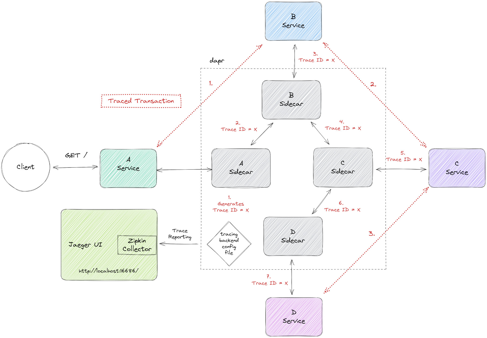

# dapr example - distributed tracing (service invocation)

<a href="https://www.dapr.io/"></a>

The following scenario is implemented here.



We want to trace a sample transaction that spans over four service.
It starts at service A, passes B and C, and ends at service D.
As the trace starts at service A, the dapr sidecar of A creates the _Trace ID_ and appends
it as request header (called `traceparent`) when requesting service B.
Then, service B has to manually forward this header when requesting service C.
C also has to forward this header manually when requesting service D.
This is [propagating sequential service calls](https://docs.dapr.io/developing-applications/building-blocks/observability/tracing-overview/#propagating-sequential-service-calls).

All tracing operations like creation and reporting to Jaeger via Zipkin collector are done by _dapr_,
which is explicitly configured to do distributed tracing using the `tracing-config.yaml`.


## Prerequisites

- [dapr CLI](https://docs.dapr.io/getting-started/install-dapr-cli/)
- Java (Version >=17)
- A running [Jaeger](https://www.jaegertracing.io/) instance
  ```shell
  docker run \
  -e COLLECTOR_ZIPKIN_HOST_PORT=:9412 \
  -p 16686:16686 \
  -p 9412:9412 \
  jaegertracing/all-in-one
  ```


## Get started

### 1. Build all services

```shell
./gradlew buildAllServices
```

### 2. Run each service alongside a dapr sidecar

```shell
dapr run --app-id a-service --app-port 8080 --app-protocol http --dapr-http-port 3500 --config tracing-config.yaml -- java -cp a/build/libs/fat.jar com.example.AKt
dapr run --app-id b-service --app-port 8081 --app-protocol http --dapr-http-port 3501 --config tracing-config.yaml -- java -cp b/build/libs/fat.jar com.example.BKt
dapr run --app-id c-service --app-port 8082 --app-protocol http --dapr-http-port 3502 --config tracing-config.yaml -- java -cp c/build/libs/fat.jar com.example.CKt
dapr run --app-id d-service --app-port 8083 --app-protocol http --dapr-http-port 3503 --config tracing-config.yaml -- java -cp d/build/libs/fat.jar com.example.DKt
```

As you can see, the dapr CLI is used to start up both, the dapr sidecar and the service.


### 3. Be the client - make a call to trigger tracing
```shell
curl http://localhost:8080/
```


### 4. View the traces in Jaeger UI
Visit http://localhost:16686/

# References
- [dapr concepts](https://docs.dapr.io/concepts/)
- [dapr service invocation explained](https://docs.dapr.io/developing-applications/building-blocks/service-invocation/service-invocation-overview/)
- [dapr distributed tracing](https://docs.dapr.io/developing-applications/building-blocks/observability/tracing-overview/)
- [dapr distributed tracing with jaeger](https://docs.dapr.io/operations/monitoring/tracing/jaeger/)
- [Jaeger Tracing](https://www.jaegertracing.io/)
